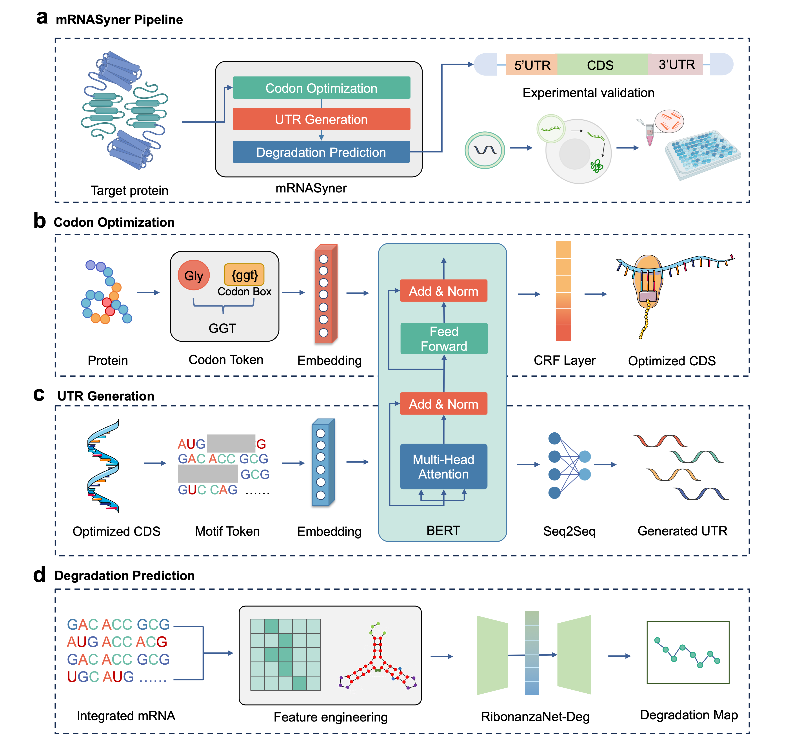

# mRNASyner: An Integrative Framework for Full-Length mRNA Sequence Optimization via Multi-Module Synergistic Design

## Overview
mRNASyner is a full-length mRNA sequence design framework based on multi-module collaborative optimization. It addresses the limitations of existing mRNA optimization methods that often focus on single modules, lack global collaborative optimization capabilities, and perform poorly in long-sequence design and functional verification loops.


This framework integrates three core modules to achieve end-to-end design of full-length mRNA sequences, adapting to long-sequence optimization and providing a new solution for personalized mRNA drug development.

## Core Modules

### 1. Codon Optimization
- Utilizes a BERT-tiny-CRF framework combined with "codon box" encoding to optimize CDS sequences.
- Improves the codon adaptation index (CAI) while enhancing structural stability by regulating GC content.
- Transforms the codon optimization task into a multi-class named entity recognition task, leveraging the self-attention mechanism of the Transformer architecture to model long-range dependencies in sequences.

### 2. UTR Generation
- Employs a BERT-seq2seq model with K-mer tokenization to generate 5'UTR and 3'UTR sequences.
- These sequences mimic human endogenous patterns, reducing the minimum free energy (MFE) to enhance stability.
- The task is reframed as a machine translation-like one, with separate training for 5'UTR and 3'UTR models due to their distinct sequence traits.

### 3. Degradation Prediction
- Uses the RibonanzaNet-Deg model to predict nucleotide-level degradation probability.
- Enables targeted modifications to reduce degradation risk, forming a "design-prediction-modification" closed-loop.
- Built on an AutoEncoder + LSTM framework, trained on high-quality experimental data to output five degradation properties for each nucleotide position.

## Results
Validation experiments on respiratory syncytial virus (RSV) vaccine design showed:
- Optimized CDS sequences achieved improvements in CAI.
- Generated UTRs had significantly lower MFE, indicating enhanced structural stability.
- Degradation prediction accurately identified high-risk positions for modification.

## Datasets
The framework uses three distinct datasets for its tasks:
| Task | Numbers | Sources |
|------|---------|---------|
| Codon optimization | 34,799 | NCBI CCDS database |
| UTR generation | 38,313 | UCSC.hg38.knownGene dataset |
| Degradation prediction | 6,034 | Kaggle competition |

## Usage
### 1.Codon optimization


The `corpus` folder contains the dataset files:
- `train_cdbox`: Training dataset
- `dev_cdbox`: Validation dataset
- `test_cdbox`: Testing dataset


#### Training Code and Parameters 
The `bert-crf4` folder contains training code and model parameters:
- `bert_crf.py`: Training code
- `config.py`: Parameter settings and path configuration
- `bert-base-cased` and `bert-tiny` folders: Store corresponding model parameters

```bash
python bert_crf.py --mode train
```
- `mode` can be either `train` or `test`

#### codontobox.ipynb
This Jupyter notebook contains 2 scripts:
1. Converts CDS sequences to amino acid sequences and labels corresponding codon boxes, primarily used for generating training files
2. Converts output amino acid sequences + codon boxes back to CDS sequences, which can be used as input for subsequent UTR models

  
### UTR generation

Folder `UTR_gen/data/` contains training, validation, and test data in `train`, `val`, and `test` subfolders. Each subfolder includes cds, 5utr, and 3utr sequences


- `UTR_gen/bert-base-cased` folder: Contains pretrained model parameters and weights
  - `vocab_5utr.txt` and `vocab_3utr.txt`: K-mers based dictionaries for tokenization across all models


- Training/testing: `cds25utr_train.py`, `cds25utr_test.py`, `cds23utr_train.py`, `cds23utr_test.py`
- UTR generation: `cds25utr_gen.py`, `cds23utr_gen.py`
- Tokenization: `token.py` (for sequence fragmentation analysis)


```bash
# train
 python cds25utr_train.py
# test
 python cds25utr_test.py
```

#### Preprocessing & Analysis
`preprocess.ipynb` includes:
- Data processing workflow
- K-mers dictionary construction
- Evaluation metrics (Rouge, Jaccard, BLEU)
- K-mers analysis