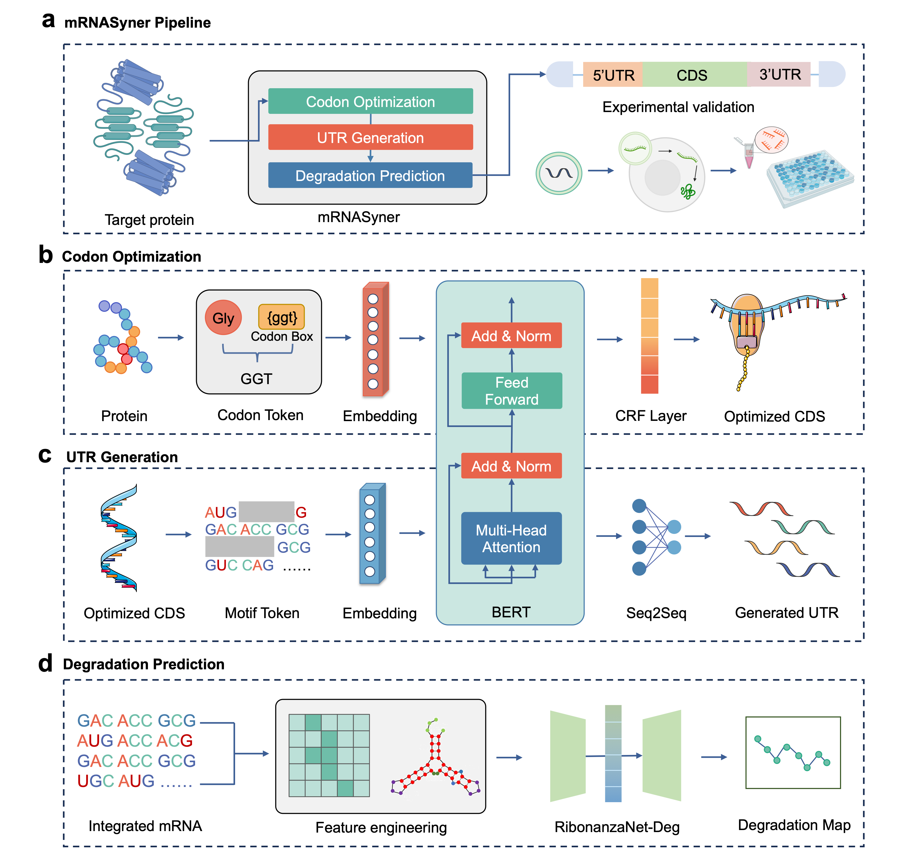

# mRNASyner: An Integrative Framework for Full-Length mRNA Sequence Optimization via Multi-Module Synergistic Design

## Overview
mRNASyner is a full-length mRNA sequence design framework based on multi-module collaborative optimization. It addresses the limitations of existing mRNA optimization methods that often focus on single modules, lack global collaborative optimization capabilities, and perform poorly in long-sequence design and functional verification loops.


This framework integrates three core modules to achieve end-to-end design of full-length mRNA sequences, adapting to long-sequence optimization and providing a new solution for personalized mRNA drug development.
## Installation
### 1. Clone the repository
First, clone the mRNASyner repository to your local machine:
```bash
git clone https://github.com/leo97king/mRNASyner.git
```
### 2. Download model weights
Download the model weights via [Google Drive](https://drive.google.com/drive/folders/1a3O6CyBfhU2foKR92vsCFRbaDIs_Jx1M?usp=sharing) and place the weights in the corresponding folder.
#### 1.Codon Optimization
- `./CDS_opt/bert-base-cased/pytorch_model.bin`
- `./CDS_opt/model/checkpoint.pt`
- `./UTR_gen/model/cds23utr_model.bin`
- `./UTR_gen/model/cds25utr_model.bin`        

### 3. Create a Conda environment
Create a new Conda environment and install the required software:
```bash
conda env create -f environment.yml
conda activate mRNASyner
```


### 4. Run scripts
```bash
sh run.sh
```
## Core Modules

### 1. Codon Optimization
- Utilizes a BERT-tiny-CRF framework combined with "codon box" encoding to optimize CDS sequences.
- Improves the codon adaptation index (CAI) while enhancing structural stability by regulating GC content.
- Transforms the codon optimization task into a multi-class named entity recognition task, leveraging the self-attention mechanism of the Transformer architecture to model long-range dependencies in sequences.

### 2. UTR Generation
- Employs a BERT-seq2seq model with K-mer tokenization to generate 5'UTR and 3'UTR sequences.
- These sequences mimic human endogenous patterns, reducing the minimum free energy (MFE) to enhance stability.
- The task is reframed as a machine translation-like one, with separate training for 5'UTR and 3'UTR models due to their distinct sequence traits.

### 3. Degradation Prediction
- Uses the RibonanzaNet-Deg model to predict nucleotide-level degradation probability.
- Enables targeted modifications to reduce degradation risk, forming a "design-prediction-modification" closed-loop.
- Built on an AutoEncoder + LSTM framework, trained on high-quality experimental data to output five degradation properties for each nucleotide position.

## Results
Validation experiments on respiratory syncytial virus (RSV) vaccine design showed:
- Optimized CDS sequences achieved improvements in CAI.
- Generated UTRs had significantly lower MFE, indicating enhanced structural stability.
- Degradation prediction accurately identified high-risk positions for modification.

## Datasets
The framework uses three distinct datasets for its tasks:
| Task | Numbers | Sources |
|------|---------|---------|
| Codon optimization | 34,799 | NCBI CCDS database |
| UTR generation | 38,313 | UCSC.hg38.knownGene dataset |
| Degradation prediction | 6,034 | Kaggle competition |

